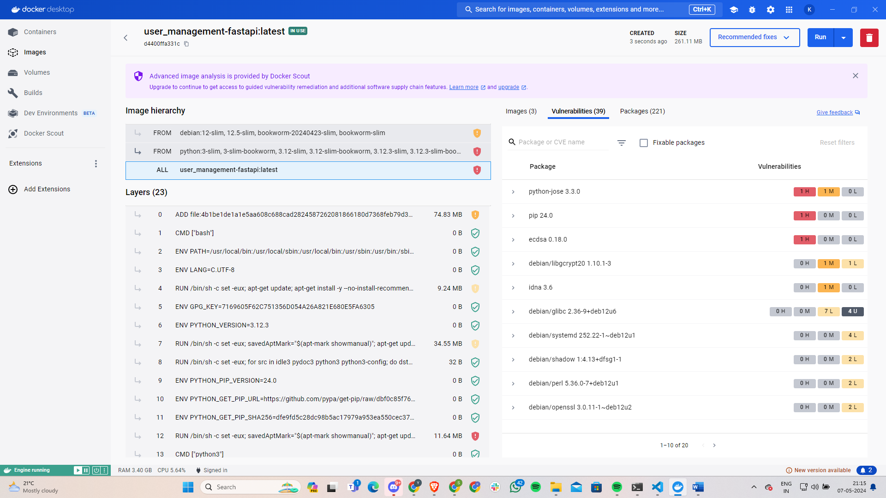

# IS601-Final Project-User Management 

Reflection document: (Reflection on Project Experience.pdf)

# Issues solved
Debugged and performed 5 QA operations for the following issues

- issue 1[https://github.com/karthikyeluripati/user_management/pull/2] 
- issue 2[https://github.com/karthikyeluripati/user_management/pull/3]
- issue 3[https://github.com/karthikyeluripati/user_management/pull/4]
- issue 4[https://github.com/karthikyeluripati/user_management/pull/5]
- issue 5[https://github.com/karthikyeluripati/user_management/pull/6]

# Docker 
[link to docker repo](https://hub.docker.com/repository/docker/karthikysvk/user_management/general)

# Mailtrap

Mailtrap as mentioned, is used to send emails to the users for registration and other services

# RBAC Enhancements 

RBAC Enhancements is chosen as a feature for this application. This feature includes, the authorized user (ADMIN/MANAGER) can change the role of registered users.

- Create user

- Updated database after creating the user

- Default Role: Anonymous

- Authorised user changing the role of the second user to manager(Anonymous to Manager)

# Test Coverage

Test cases were added to this feature and achieved a 91% Test Coverage

